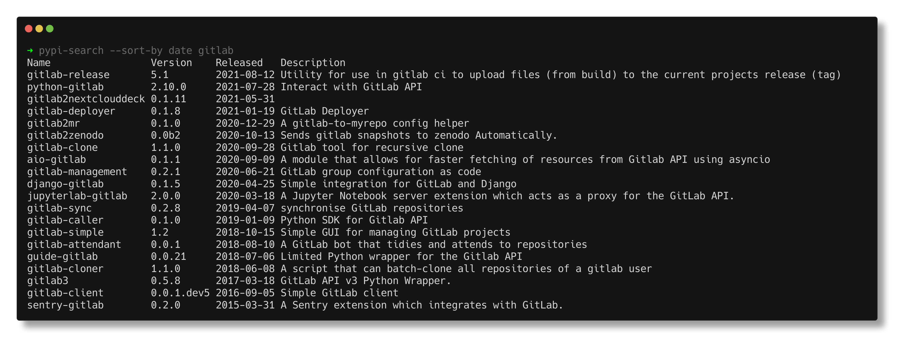

# PyPI Search

Search the PyPI for packages by name aka `pip search`.

This was heavily inspired by [pip_search](https://github.com/victorgarric/pip_search) which looks fantastic but is a little slow. Also the output is unnecessary hard to process by other command line tools.

## Features
Search the Python Package Index by package name with `pypi-search STRING`

and sort by name or release date with `pypi-search --sort-by (date|name)`

## Installation

`cargo install pypi-search`

